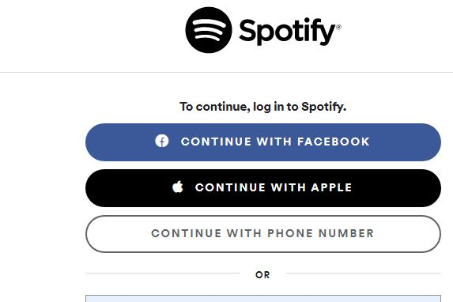
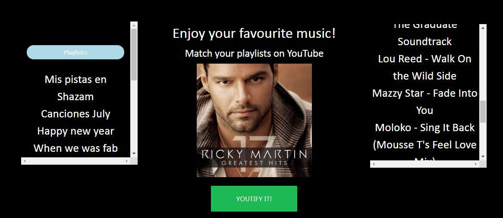
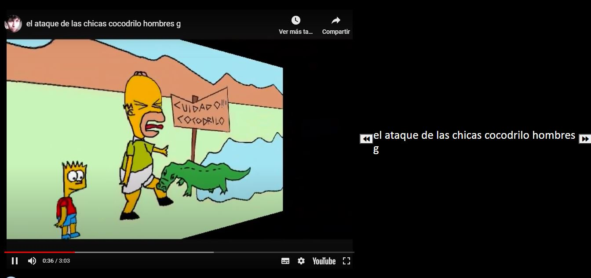

# Youtify!

## Overview

* This app will move the playlist from Spotify to create a custom list in Youtube and display the videos
* The app ask for the spotify login, this request will use the Spotify API to login with your account
* After entering to the app you will see all your public playlists and you should be able to select each playlist to navigate in the songs list
* After selecting a playlist and pressing the "Youtify!" button, the magic will happen
* A video element will be added at the end of the screen and you will see all your playlist reproduced on this element, you should be able to go to the next or previous song

## Technologies used to develop the app

- HTML5
- CSS3
- Bootstrap
- Materialize
- Javascript
- JQuery
- JSON
- Axios

##Group Project

https://github.com/alecvipa/Youtify

## App Link
https://alecvipa.github.io/Youtify/

## Author
ISC Francisco Silva
